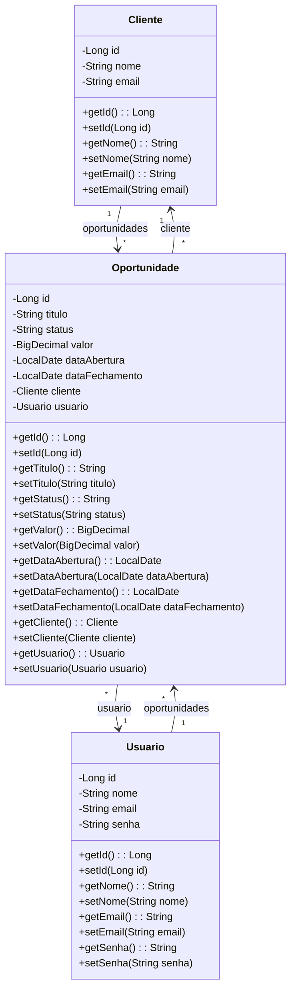

# Kavio CRM - Sistema de Gestão de Relacionamento com o Cliente

<br />

<div align="center">
  
</div>

<br />

## 📌 Descrição

*O **Kavio CRM** é uma plataforma completa para gerenciamento de clientes e oportunidades, com foco em produtividade comercial, organização e automação de processos de relacionamento.*

------

## 🚀 Sobre este Sistema

O Sistema **Kavio CRM** oferece recursos essenciais para controle de **clientes** e **oportunidades comerciais**, com endpoints seguros, bem definidos e integráveis com outras soluções corporativas.

### Principais Funcionalidades

1.  **Gestão de Clientes:**
    Cadastro, Leitura, Atualização e Exclusão (CRUD). Busca por todos, por ID e por nome.
2.  **Gestão de Oportunidades:**
    Cadastro, Leitura, Atualização e Exclusão (CRUD). Busca por todos, por ID e por descrição.
3.  Relacionamento entre Oportunidades e seus respectivos Clientes.

------

## 🧩 Diagrama de Classes (Simplificado)



------

## 🗃️ Diagrama Entidade-Relacionamento (DER)

<div align="center">
    
</div>

------

## 🛠️ Tecnologias utilizadas

| Item                          | Descrição           |
| ----------------------------- | ------------------- |
| **Servidor**                  | Tomcat              |
| **Linguagem de programação**  | Java                |
| **Framework**                 | Spring Boot         |
| **ORM**                       | JPA + Hibernate     |
| **Banco de dados Relacional** | MySQL               |

------

## 🧪 Configuração e Execução

1. Clone o repositório do Projeto **Kavio CRM**:

```bash
git clone https://github.com/seu-usuario/kavio-crm](https://github.com/Cavaleiros-Templarios/projeto_03_backend.git)
```

2. **Abra o Eclipse/STS** e selecione a pasta do *Workspace* onde você clonou o repositório do projeto  
3. No menu superior do Eclipse/STS, clique na opção: **File 🡲 Import...**  
4. Selecione: **General 🡲 Existing Projects into Workspace**  
5. Clique em **Browse...**, selecione a pasta do projeto e clique em **Finish**

------

## 📬 Contato

Desenvolvido por:

- [**Wesley Lima**](https://github.com/Wezzlim)  
- [**Alex Ikezili**](https://github.com/alexikezili)  
- [**Gustavo Brassaroto Lira**](https://github.com/Brassaroto)  
- [**Cristiano Forner**](https://github.com/cristianoforner)  
- [**Fabricio Vicente Soares**](https://github.com/Fabriciovics)  
- [**Marcos Meneses**](https://github.com/MarcosvMeneses)  
- [**Pedro Henrique**](https://github.com/phccoelho)  
- [**Thiago Tasseli**](https://github.com/tasselii) 

_Fique à vontade para contribuir, sugerir melhorias ou relatar bugs!_ 🚀
